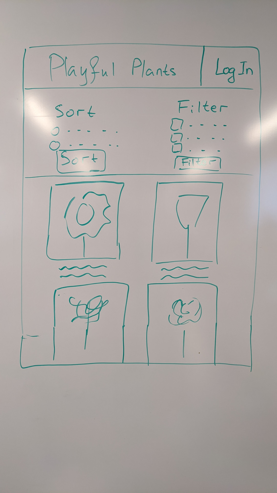
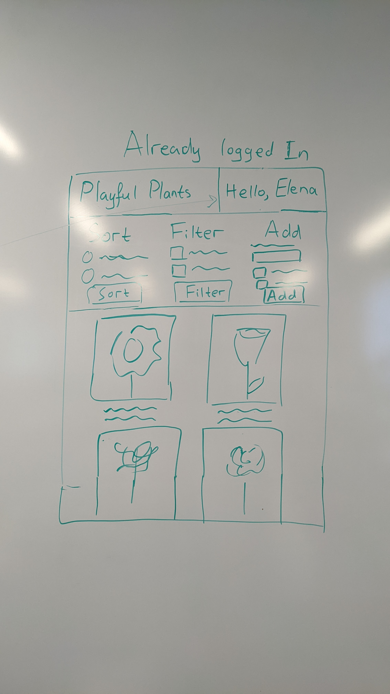

# Project 2: Design Journey

**For each milestone, complete only the sections that are labeled with that milestone.** Refine all sections before the final submission. If you later need to update your plan, **do not delete the original plan, leave it place and append your new plan below the original.** Explain why you are changing your plan. Remember you are graded on your design process. Updating the plan documents your process!

**Replace ALL _TODOs_ with your work.** (There should be no TODOs in the final submission.)

Be clear and concise in your writing. Bullets points are encouraged.

**Everything, including images, must be visible in Markdown Preview.** If it's not visible in Markdown Preview, then we won't grade it. We won't give you partial credit either. **Your design journey should be easy to read for the grader; in Markdown Preview the question _and_ answer should have a blank line between them.**


## Design / Plan (Milestone 1)

**Make the case for your decisions using concepts from class, as well as other design principles, theories, examples, and cases from outside of class (includes the design prerequisite for this course).**

You can use bullet points and lists, or full paragraphs, or a combo, whichever is appropriate. The writing should be solid draft quality.

### Audiences (Milestone 1)

> Who are your site's audiences?
> Briefly explain who the intended audiences are for your project website.
> **DO NOT INVENT RANDOM AUDIENCES HERE!** Use the audiences from the requirements.

_Consumer_: parents with developing children. They care about creating nature-rich spaces and plan to garden using this site's data in order to provide high quality nature-rich places on a smaller scale around their homes and communities.

_Site Administrator_: members of the Playful Plants project. They develop a (searchable) database of playful plants that can support a range of nature play experiences, provide ideas and plant collections for themed nature play spaces & gardens, and develop a web resource for sharing these resources, including the ability to tailor selections based on tags.


### _Consumer_ Audience Goals (Milestone 1)

> Document your audience's goals.
> List each goal below. There is no specific number of goals required for this, but you need enough to do the job.
> **DO NOT INVENT RANDOM GOALS HERE OR STEREOTYPE HERE!** Your goals are things that your users want accomplish when using the site (e.g. print a list of plants). These are informed by the Playful Plants objectives. Review the assignment's requirements for details.

_Consumer_ Goal 1: View plants that are well-suited for play

- **Design Ideas and Choices** _How will you meet those goals in your design?_
  - Providing a catalog of plants on the website.
- **Rationale & Additional Notes** _Justify your decisions; additional notes._
  - A searchable catalog of plants will allow the consumers to view all plants in the database of the Playful Plants project.

_Consumer_ Goal 2: Sort catalog of plants

- **Design Ideas and Choices** _How will you meet those goals in your design?_
  - Providing a sort form.
- **Rationale & Additional Notes** _Justify your decisions; additional notes._
  - A sort form will allow the consumers to sort the catalog of plants based on their needs.

_Consumer_ Goal 3: Filter catalog of plants based on tags and other plant features

- **Design Ideas and Choices** _How will you meet those goals in your design?_
  - Providing a filter form.
- **Rationale & Additional Notes** _Justify your decisions; additional notes._
  - A filter form will allow the consumers to filter the catalog so that they can view only plants with specific tags and features.

### _Consumer_ Persona (Milestone 1)

> Use the goals you identified above to develop a persona of your site's audience.
> Create your persona using GenderMag's customizable personas.
> Take a screenshot and include it here. Persona must be visible in Markdown Preview; do not use PDF format!


### _Administrator_ Audience Goals (Milestone 1)

> Document your audience's goals.
> List each goal below. There is no specific number of goals required for this, but you need enough to do the job.
> **DO NOT INVENT RANDOM GOALS HERE OR STEREOTYPE HERE!** Your goals are things that your users want accomplish when using the site (e.g. print a list of plants). These are informed by the Playful Plants objectives. Review the assignment's requirements for details.

_Administrator_ Goal 1: Develop a searchable database of playful plants that can support a range of nature play experiences.

- **Design Ideas and Choices** _How will you meet those goals in your design?_
  - Through providing functionality for adding and deleting plants in the catalog.
- **Rationale & Additional Notes** _Justify your decisions; additional notes._
  - If the administrator has the ability to add and remove plants in the catalog, they can develop a useful database of playful plants that can be viewed and searched by the consumers.

_Administrator_ Goal 2: Provide ideas & plant collections for themed nature play spaces & gardens.

- **Design Ideas and Choices** _How will you meet those goals in your design?_
  - By providing a functuinality for plant_tags plants in the catalog.
- **Rationale & Additional Notes** _Justify your decisions; additional notes._
  - By plant_tags the plants in the catalog, the administrators will be able to tailor the plant selections and provide ideas for themes nature play spaces.

_Administrator_ Goal 3: Search through existing database and sort and filter catalog.

- **Design Ideas and Choices** _How will you meet those goals in your design?_
  - Through adding a searchable catalog as well as a sort/filter form.
- **Rationale & Additional Notes** _Justify your decisions; additional notes._
  - Through the catalog, the administrators will be able to view all plants in the existing database of the Playful Plants Project. The sort/filter form will also allow them to sort and filter the plants based on their needs.


### _Administrator_ Persona (Milestone 1)

> Use the goals you identified above to develop a persona of your site's audience.
> Create your persona using GenderMag's customizable personas.
> Take a screenshot and include it here. Persona must be visible in Markdown Preview; do not use PDF format!


### Site Design (Milestone 1)

> Document your _entire_ design process. **We want to see iteration!**
> **Show us the evolution of your design from your first idea (sketch) to the final design you plan to implement (sketch).**
> **Show us how you decided what data to display to each audience.**
> **Plan your URLs for the site.**
> **Provide a brief explanation _underneath_ each design artifact (2-3 sentences).** Explain what the artifact is, how it meets the goals of your personas (**refer to your personas by name**).
>
> **Important!** Plan _all_ site requirements. Don't forget login and logout.

_Initial Designs / Design Iterations:_

The pictures below are the initial design that I planned during the lab session on Friday.







In this design, there is a administrator view and a consumer view. The consumers only sees a sort and a filter form while the administrators also see an add form and their name in the right top corner.

_Iteration 1:_

The pictures below contain a revised version of the initial design.


This is the page that the consumers see. They can sort and filter the catalog using the buttons at the top. When they click on an image from the catalog, they are redirected to a details page for this specific plant.


This is the login page that the administrators use to log in.


This is the administrators view of the site. They can sort and filter the data like the consumers. They can also add plants through a form, add tags, and remove plants.


_Iteration 2:_

Based on the feedback that I received from Milestone 1, I revised the design of the consumer view and the administrators view. The revised design is shown in the pictures below:


This is the new design for the consumers' view of the web site. Now it is made for a use on a mobile phone device, as per the requirements. Again, Abi can sort and filter the catalog using the buttons at the top. Each sort and and filter criteria is a drop down which contains options. For example, the Tag drop down contains check boxes for existing tags, while the Sort drop down contains radio buttons for different sorting criteria. Also, when the Abi clicks on an image from the catalog, she is redirected to a details page for this specific plant.


This is the new administrators view of the site. Now it contains an Edit button for each entry, as required for this project. When Tim clicks on the Edit button for some plant, he is redirected to a new page that contains a form with the properties of this plant. Tim will be able to change the values of the inputs in the form, and when he submits the form, these new values will be applied to the database.

### Design Pattern Explanation/Reflection (Milestone 1)

> Write a one paragraph (6-8 sentences) reflection explaining how you used design patterns for media catalogs in your site's final design.

One design pattern that I used is having a catalog of images in rows, each of each leading to a page specific for this image. I will also have a sort option with a drop-down menu, which is another common element in media catalogs. There will also be a filtering button, which opens a small window with filter options. This is something that I have seen in many media catalogs as well.


### Cognitive Styles Explanation/Reflection (Milestone 1)

> Write a one paragraph (6-8 sentences) reflection explaining how your final design supports the cognitive styles of each persona.

_Consumer Cognitive Styles Reflection:_

Abi would be able to view the whole catalog and get an idea about what the catalog looks like (comprehensive information processing style). Since Abi has lower self confidence about doing unfamiliar computing tasks, the design will be simple without many unnecesary features, which would make Abi feel more comfortable working with. This also correleates with Abi's attitude toward Risk: Abi's life is a little complicated and she rarely has spare time. Therefore, this simplified version will help her navigate through the website without spending too much time.


_Site Administrator Cognitive Styles Reflection:_

Tim's Motivations is to learn all the available functionality and likes tinkering and exploring the menu items and functions of the software. This design will allow him to do so by playing around with the sort and filter buttons. The Delete Plant button will also allow him to experiment with the add form by adding a plant and then removing it. The administrator's view of the website is a bit more complicated than the view for consumers but this is okay, since Tim has high confidence in his abilities with technology.


## Implementation Plan (Milestone 1, Milestone 2, Milestone 3, Final Submission)

### Database Schema (Milestone 1)

> Describe the structure of your database. You may use words or a picture. A bulleted list is probably the simplest way to do this. Make sure you include constraints for each field.
> **Hint: You probably need a table for "entries", `tags`, `"entry"_tags`** (stores relationship between entries and tags), and a `users` tables.
> **Hint: For foreign keys, use the singular name of the table + _id.** For example: `image_id` and `tag_id` for the `image_tags` (tags for each image) table.

Table: users

- user_id: INT {PK, NN, U, AI}
- username: STR {NN, U}
- password: STR {NN}


Table: plants

- id: INT {PK, NN, U, AI}
- plant_name_coll: STRING {NN}
- plant_name_spec: STRING {NN, U}
- plant_ID: STRING {NN, U}
- exploratory_constructive_play: INT {NN}
- exploratory_sensory_play: INT {NN}
- physical_play: INT {NN}
- imaginative_play: INT {NN}
- restorative_play: INT {NN}
- expressive_play: INT {NN}
- play_with_rules: INT {NN}
- bio_play: INT {NN}


Table: tags

- tag_id: INT {PK, NN, U, AI}
- tag_name: STR {NN, U}


Table: plant_tags

- id: INT {PK, NN, U, AI}
- plant_id: INT {NN, U, For}
- tag_id: INT {NN, U}
- FOREIGN KEY (plant_id) REFERENCES plants(id)
- FOREIGN KEY (tag_id) REFERENCES tags(tag_id)

In the last combination, each combination of plant_id and tag_id should be unique.


### Database Query Plan (Milestone 1, Milestone 2, Milestone 3, Final Submission)

> Plan _all_ of your database queries. You may use natural language, pseudocode, or SQL.

```
Add a new plant:
INSERT INTO plants (plant_name_coll, plant_name_spec, plant_ID, exploratory_constructive_play, ...) VALUES ('sample_name_coll', 'sample_name_spec', 'sample_plant_id', 0, 1, ....);
```

```
Tag a plant with id 1 with a tag with id 9:
INSERT INTO plant_tags (plant_id, tag_id) VALUES (1, 9);
```

```
Get a user with the provided password and username:
SELECT * FROM users WHERE username='provided_username' AND password='provided_password';
```

```
Sort catalog by plant name:
SELECT * FROM plants ORDER BY plant_name_coll ASC;
```

```
Filter catalog by tag name:
SELECT * FROM plants
INNER JOIN plant_tags ON plants.id = plant_tags.plant_id
INNER JOIN tags ON plant_tags.tag_id = tags.tag_id
WHERE tags.tag_name = 'Tree';
```

```
Delete a plant:
DELETE FROM plants
WHERE plant_ID = 'TT_17';
```

```
Delete a tag from a deletef plant:
DELETE FROM plant_tags
WHERE plant_id = 'TT_17';
```

```
Get all details of a plant with plant_ID FE_1 inclding its tags:
SELECT plant_name_coll, plant_name_spec, exploratory_constructive_play, ..., tags.tag_name FROM plants
LEFT OUTER JOIN plant_tags ON plants.id = plant_tags.plant_id
LEFT OUTER JOIN tags ON plant_tags.tag_id = tags.tag_id
WHERE plants.plant_ID = 'FE_1';
```

### Code Planning (Milestone 1, Milestone 2, Milestone 3, Final Submission)

> Plan any PHP code you'll need here using pseudocode.
> Tip: Break this up by pages. It makes it easier to plan.

```
Consumers view page:

1. Check if sort is selected, and if so, add the corresponding "ORBER BY" part to the main SQL query to sort the catalog. Add sticky values for the sort. (Milestone 3)
2. Check if a filter is selected, add the corresponding 'WHERE' part to the main SQL query to filter the catalog. Add sticky values for the filters selected. (Milestone 3 - Not finished)
3. Execute the main SQL query to obtain all plants that meet the selected sort and filter criteria. (Milestone 2)
4. In the media catalog, for each entry, get the plant_ID of the corresponding plant, and add an image whose name is the same as this plant_ID. Also, add a link that leads to a details page for this entry with corresponding parameters. (Milestone 2)
```

```
Login page:

1. Obtain the username and the password that were provided when submitting the login form. (Final Submission)
2. Send a SELECT SQL query to check if there exists a record in the users table with the provided username and password. (Final Submission)
3. If there exists a record, redirect user to administrators view. (Final Submission)
4. If there is no such record, provide corrective feedback. (Final Submission)
```

```
Administrators view page:

1. Check if sort is selected, and if so, add the corresponding "ORBER BY" part to the main SQL query to sort the catalog. Add sticky values for the sort. (Milestone 3)
2. Check if a filter is selected, add the corresponding 'WHERE' part to the main SQL query to filter the catalog. Add sticky values for the filters selected. (Milestone 3 - Not finished)
3. Execute the main SQL query to obtain all plants that meet the selected sort and filter criteria. (Milestone 3)
4. Check if the add form was submitted. If so, validate the form. If the form was valid, add the plant to the catalog using an SQL INSERT query. If not, provide corrective feedback. (Milestone 3)
5. Check if the Delete button under some plant entry was clicked. If so, execute a DELETE SQL query to delete the corresponding plant from the database. (Milestone 3)
6. Check if the Edit button under some plant entry was clicked. If so, redirect the user to a page that contains a form for editing this plant, with its current values pre-filled in the form. (Milestone 3)
5. Add a field to the "Add Plant" form for image uploading. (Final submisson)
```

```
Edit plant page:

1. Check if the form was submitted. (Milestone 3)
2. If it was submitted, validate the form and provide corrective feedback if necessary. (Milestone 3)
3. Execute an SQL query to update the corresponding record in the database. (Milestone 3)
4. If the plant was successfully updated, display a confirmation message. (Milestone 3)
5. Add a form field for image uploading. (Final submisson - Not finished)
```

```
Final submission plan:

1. Currently, when you submit the form on the edit page for a plant, you would get an error. I will fix this for the final submission. (DONE)
2. Add image uploads to edit page and Add plant form. (DONE)
3. Make filters work - currently they don't do anything. (DONE)
4. Improve design of filter buttons as per feedback from Milestone 3. (DONE)
5. Support multiple tags per plant. Currently, each plant can only have one tag.
6. Add more user credentials to the database.
7. Implement user access.
8. Polish design of website.
9. Clean up and organize code. (DONE)
10. Fix filled values in Edit form on the Edit page.
11. Test all pages.
```

### Accessibility Audit (Final Submission)

> Tell us what issues you discovered during your accessibility audit.
> What do you do to improve the accessibility of your site?

TODO


## Reflection (Final Submission)

### Audience (Final Submission)

> Tell us how your final site meets the goals of your audiences. Be specific here. Tell us how you tailored your design, content, etc. to make your website usable for your personas.

TODO


### Additional Design Justifications (Final Submission)

> If you feel like you haven’t fully explained your design choices in the final submission, or you want to explain some functions in your site (e.g., if you feel like you make a special design choice which might not meet the final requirement), you can use the additional design justifications to justify your design choices. Remember, this is place for you to justify your design choices which you haven’t covered in the design journey. You don’t need to fill out this section if you think all design choices have been well explained in the design journey.

TODO


### Self-Reflection (Final Submission)

> Reflect on what you learned during this assignment. How have you improved from Project 2? What would you do differently next time?

TODO


> Take some time here to reflect on how much you've learned since you started this class. It's often easy to ignore our own progress. Take a moment and think about your accomplishments in this class. Hopefully you'll recognize that you've accomplished a lot and that you should be very proud of those accomplishments!

TODO


### Grading: Step-by-Step Instructions (Final Submission)

> Write step-by-step instructions for the graders.
> The project if very hard to grade if we don't understand how your site works.
> For example, you must login before you can delete.
> For each set of instructions, assume the grader is starting from /

_View all entries:_

1. TODO

2.

_View all entries for a tag:_

1. TODO

2.

_View a single entry's details:_

1. TODO

2.

_How to insert and upload a new entry:_

1. TODO

2.

_How to delete an entry:_

1. TODO

2.

_How to edit and existing entry and its tags:_

1. TODO

2.
